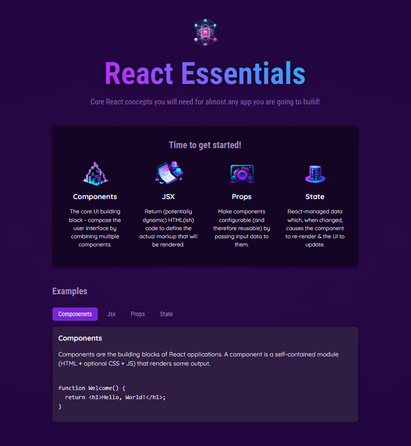

# Reactkeyconcepts
This is a project for understanding what is react and what is the key concepts of it
While this project i learned key concepts of react such as props state conditional rendering
This project made by lean react code there is no third party app in this project
- [Overview](#overview)
  - [Screenshot](#screenshot)
  - [Links](#links)
### Screenshot

### Links
- Live Site URL:(https://reactkeyconcepts-fnv8.vercel.app/)